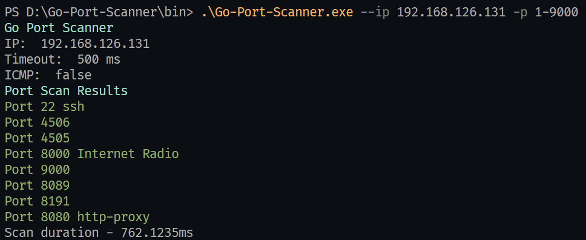
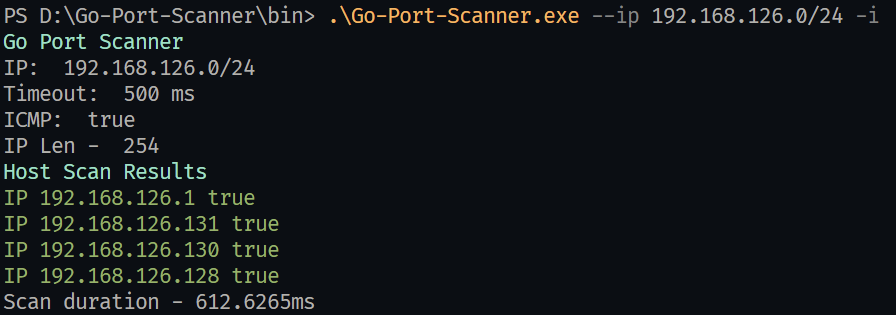

<!-- PROJECT LOGO -->
<br />
<div align="center">
  <h1 align="center">Go Port Scanner</h1>

  <p align="center">
    ·
    <a href="https://github.com/othneildrew/Best-README-Template">Binaries</a>
    ·
    <a href="https://github.com/shahnitav/Go-Port-Scanner/issues">Report Bug</a>
    ·
    <a href="https://github.com/shahnitav/Go-Port-Scanner/issues">Request Feature</a>
  </p>
</div>

<!-- TABLE OF CONTENTS -->
<details>
  <summary>Table of Contents</summary>
  <ol>
    <li>
      <a href="#about-the-project">About The Project</a>
      <ul>
        <li><a href="#built-with">Built With</a></li>
      </ul>
    </li>
    <li>
      <a href="#getting-started">Getting Started</a>
      <ul>
        <li><a href="#prerequisites">Prerequisites</a></li>
        <li><a href="#installation">Installation</a></li>
        <li><a href="#build">Build</a></li>
      </ul>
    </li>
    <li><a href="#options">Options</a></li>
    <li><a href="#usage">Usage</a></li>
    <li><a href="#roadmap">Roadmap</a></li>
    <li><a href="#contributing">Contributing</a></li>
    <li><a href="#license">License</a></li>
    <li><a href="#contact">Contact</a></li>
    <li><a href="#acknowledgments">Acknowledgments</a></li>
  </ol>
</details>

<!-- ABOUT THE PROJECT -->
## About The Project

Go Port Scanner is a lightweight and extremely fast port & host scanner.



`Port Scan`



`Host Discovery`

I decided to build this port scanner using Golang because of the concurrency provided by Go. I am using goroutines to check the status of multiple ports/hosts simulatenously. This leads to higher resource efficiency and speed to complete the scan. On an average Go Port Scanner was able to get the result in 50% less time compared to Nmap's fast scan. 

### Built With

* [Go](https://nextjs.org/)
* [argparse](https://pkg.go.dev/github.com/akamensky/argparse)
* [color](https://pkg.go.dev/github.com/fatih/color)
* [ping](https://pkg.go.dev/github.com/sparrc/go-ping)

<!-- GETTING STARTED -->
## Getting Started

Instructions to set up this project in your local environment are listed down below.

### Prerequisites

* Go v1.18
  ```sh
  https://go.dev/doc/install
  ```
* Git
  ```
  https://git-scm.com/
  ```

## Installation

   Get the repository with go get
   ```sh
   go get github.com/shahnitav/Go-Port-Scanner
   ```
  Or get the pre-build binary from the [Releases](https://github.com/shahnitav/Go-Port-Scanner/releases).

## Build
  To build the project
  1. Clone the repository
      ```
      git clone https://github.com/shahnitav/Go-Port-Scanner.git
      ```
  2. Run make
      ```sh
      make
      ```
      Or build the binary using 
      ```
      go build -o bin/ cmd/main.go
      ```

## Options
### `--ip [IP Address]`
Target IP Address/es whose Ports need to be scanned. It can parse single IP Address for Port Scanning as well as CIDR which can be used for Host Discovery.

For example:
```
--ip 192.168.126.131 || --ip 192.168.126.131
```
### `-p [Port Numbers]` `--port [Port Numbers]`
Specifies the ports to be scanned for to get their status. It can be a single value, a range of values, or multiple values. Port Numbers are required for Port Scanning and will not be considered during Host Discovery.

For example:
```
-p 80 || --port 1-9000 || -p 80,443,21
```
### `--t [Timeout]`
Used to configure the timeout in Milliseconds while connecting with a Port. Not required, the default value is 500ms.

### `-i` `--icmp`
It is a flag to be passed with a Single/CIDR IP Address to scan for hosts. ICMP Mode sends ICMP Ping packets to the hosts to check their status.

For example:
```
./main --ip 192.168.126.0/24 -i
```
### `-h` `--help`
Shows the Help page

## Usage

Go Port Scanner can be used to conduct follow tasks:

### **Scan for open port on a single host**
It will scan for open port 3306 on the host.
```
./main --ip 192.168.126.131 -p 3306
```

### **Scan for a range of open ports on a single host**
It will scan for open ports from 1-9000 and also label the common ports.
```
./main --ip 192.168.126.131 -p 1-9000
```

### **Scan for multiple open ports on a single host with a timeout of 1000ms**
It will scan for multiple open ports 80,443,1202 on the host.
```
./main --ip 192.168.126.131 -p 80,443,1202 -t 1000
```

### **Discover Hosts in the provided CIDR**
It will scan for open ports from 1-9000 and also label the common ports.
```
./main --ip 192.168.126.128/28 -i
```

<!-- ROADMAP -->
## Roadmap

- [x] Parallel Port Scanning with Goroutines
- [x] Host discovery with ICMP Pings
- [ ] SYN Stealth Scanning


See the [open issues](https://github.com/shahnitav/Go-Port-Scanner/issues) for a full list of proposed features (and known issues).


<!-- CONTRIBUTING -->
## Contributing

Contributions are what make the open source community such an amazing place to learn, inspire, and create. Any contributions you make are **greatly appreciated**.

If you have a suggestion that would make this better, please fork the repo and create a pull request. You can also simply open an issue with the tag "enhancement".
Don't forget to give the project a star! Thanks again!

1. Fork the Project
2. Create your Feature Branch (`git checkout -b feature/AmazingFeature`)
3. Commit your Changes (`git commit -m 'Add some AmazingFeature'`)
4. Push to the Branch (`git push origin feature/AmazingFeature`)
5. Open a Pull Request

<!-- LICENSE -->
## License

Distributed under the GNU License. See `LICENSE` for more information.


<!-- CONTACT -->
## Contact

Nitav Shah - [@shah_nitav](https://twitter.com/shah_nitav) - shahnitav@gmail.com

[https://github.com/shahnitav/Go-Port-Scanner](https://github.com/shahnitav/Go-Port-Scanner)


<!-- ACKNOWLEDGMENTS -->
## Acknowledgments

* [Furious Port Scanner](https://github.com/liamg/furious)
* [TutorialEdge](https://tutorialedge.net/projects/building-security-tools-in-go/building-port-scanner-go/)
* [Best-README-Template](https://github.com/othneildrew/Best-README-Template)
* [Elliot Chance](https://elliotchance.medium.com/goroutines-and-channels-a-real-ly-simple-server-in-go-93ba49ff7c5c)


